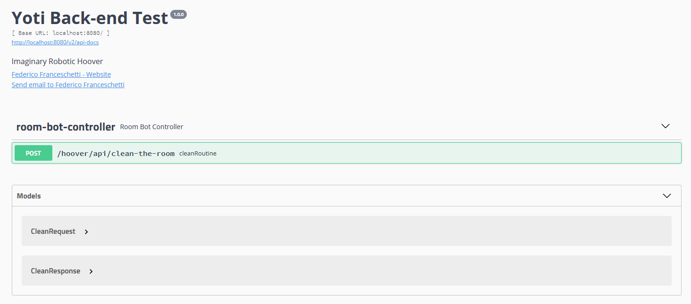
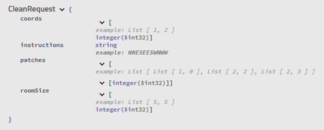
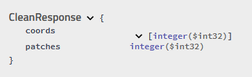

# Yoti SDK Back-end test

### Overview
This service navigates an imaginary robotic hoover through an equally imaginary room.

As input it will take:
* Room dimensions
* Locations of the dirt patches
* Hoover location
* Driving instructions

It will output the following:

* Final hoover position (X, Y)
* Number of patches of dirt the robot cleaned up

### Exposed REST apis



URL: `/hoover/api/clean-the-room`

INPUT: CleanRequest class




OUTPUT: CleanResponse class



### How to test the API

Via Swagger, it's possible to utilize a browser to interact with the REST API created:
Swagger url: http://localhost:8080/swagger-ui.html

Do the following:
* Run 'mvn package' command from root folder to create .jar file in /target folder
* Launch command 'java -jar target/RoomBot-1.0.0.jar' from root folder to start the application
* Navigate to: http://localhost:8080/swagger-ui.html and test the application

In alternative, you could test the response using the following command:
```
curl -X POST "http://localhost:8080/hoover/api/clean-the-room" -H  "accept: */*" -H  "Content-Type: application/json" -d "{  \"coords\": [    1,    2  ],  \"instructions\": \"NNESEESWNWW\",  \"patches\": [    [      1,      0    ],    [      2,      2    ],    [      2,      3    ]  ],  \"roomSize\": [    5,    5  ]}"
```

